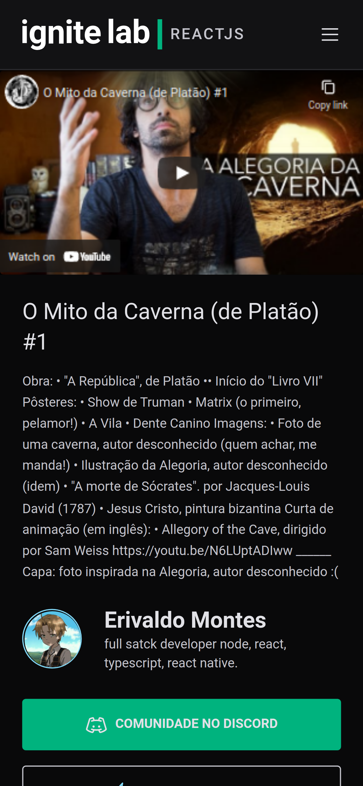

# Plataforma de eventos

<p>
  
  
  
  
  
  
</p>

### mobile
<p align="center">

  
  
</p>

### desktop
<p align=center>
  
    

</p>

## sobre
  Este projeto foi desenvolvido no evento ignite lab promovido pela [rocketseat](https://github.com/Rocketseat) que tem como objetivo ser uma plataforma de eventos em  que o participante se inscreve em um evento online e recebe as aulas ao longo da semana do evento.

## Foi feito com

  - [hygraph](https://hygraph.com/blog/graphcms-is-now-hygraph) - hygraph é o CMS Headless que permite criar experiências digitais da maneira que você as imaginou

  - [react](https://github.com/facebook/react) - bibliteca para construção de interface web de forma declarativa e componeitizada.

  - [apollo](https://github.com/apollographql/apollo-client) - Um cliente GraphQL com armazenamento em cache completo e pronto para produção para cada estrutura de interface do usuário e servidor GraphQL.

  - [codegen](https://www.graphql-code-generator.com/) - Gere código de seu esquema e operações do GraphQL com uma CLI simples.

  - [typescript](https://github.com/microsoft/TypeScript) - TypeScript é um superconjunto de JavaScript que compila para limpar a saída de JavaScript.

  - [graphql](https://graphql.org/) - GraphQL é uma linguagem de consulta para APIs e um tempo de execução para atender a essas consultas com seus dados existentes.

  - [tailwind](https://tailwindcss.com/) - Um framework CSS de primeira utilidade com classes como flex, pt-4, text-center e rotate-90 que podem ser compostas para construir qualquer design, diretamente em sua marcação.

  - [vite](https://vitejs.dev/) - Ferramentas de front-end de próxima geração.

  - [redux](https://redux.js.org/) - Um contêiner de estado previsível para aplicativos JS.
  
## instalação

primeiramente instale as dependências

```sh
 npm install
``` 
ou 

```sh
yarn
```
para rodar o projeto execute

```sh
npm run dev
```
ou 
```sh
yarn dev
```

como o projeto foi produzido com o graphcms deve-se configurar as credências
de acesso.
primeiro crie uma varialvel de ambiente chamada <strong>VITE_API_ACCESS_TOKEN</strong> que deve conter token de autorização do graphcms

segundo crie outra variavel de ambiente com o nome <strong>VITE_URL</strong> que será
o endereço do banco de dados do graphcms

